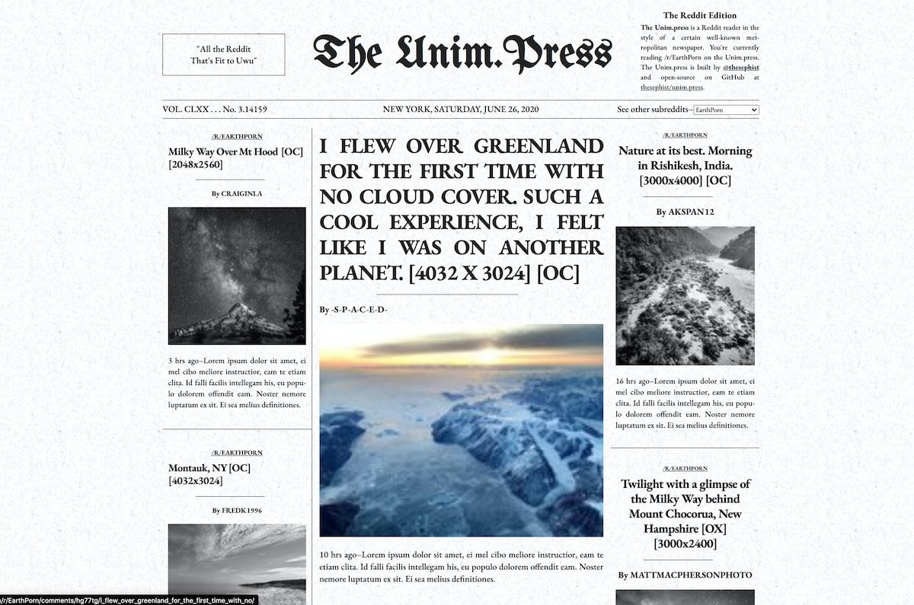

# Unim.Press 📰

[Unim.Press](https://unim.press) is a Reddit front-page reader in the style of The New York Times. You can browse the front page of any subreddit by going to `unim.press/#subreddit_name`.

Unim.Press is built with [Torus](https://github.com/thesephist/torus) as a static, single page application, and uses the public Reddit API.

